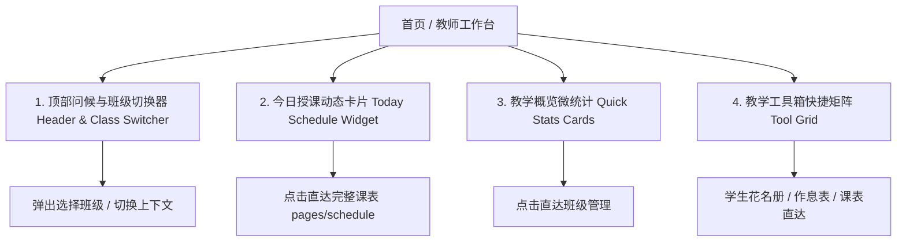

# 教师工作台首页 (`pages/index/index`) 实现方案

本方案旨在将现有的首页占位页面升级为功能完备、体验流畅的**高保真「教师专属智能工作台」**。作为教师进入小程序后的第一视角，首页聚焦于**当前班级上下文、今日课表动态看板、核心教学统计与高频操作快捷直达**。

---

## 一、 核心架构与功能模块设计

### 1. 顶部身份问候与当前班级切换器 (Header & Context Switcher)
- **温情动态问候**：根据当前时间自动显示「早上好/下午好/晚上好，{教师称呼}老师」，并附带教师头像微标。
- **当前激活班级切换器**：
  - 顶部显眼胶囊显示当前选中的班级（如 `八年级三班 ▾`）；
  - 点击弹出 TDesign 班级选择滚轮（`t-picker`），支持一键切换当前工作班级；
  - 若教师尚未创建班级，显示「+ 立即建班」引导卡片。

### 2. 今日授课动态看板 (Today's Schedule Widget)
- **智能日期定位**：自动获取当前星期（如 `周一`）并匹配教师的排课数据（`schedules`）与作息时间（`periods`）。
- **实时课程状态**：
  - 若今日有课：以时间轴卡片高亮呈现今日课程清单，显示节次、时间、班级、学科与教室；根据当前系统时间智能标记 `进行中` 或 `下一节`。
  - 若今日无课：呈现清新舒适的「今日暂无排课，享受轻松的一天」空闲卡片。
- **直达入口**：右上角配备「完整课表 →」，点击直跳 [pages/schedule/index](file:///Users/moliang/Desktop/coder/teacher/app/miniprogram/pages/schedule/index)。

### 3. 教学微统计仪表板 (Stats Overview)
- 3 栏极简高质感微卡片：
  - **当前班级学生**：`N` 人（点击直达花名册）
  - **今日授课**：`M` 节（实时联动今日排课）
  - **管理班级**：`K` 个（点击直达班级列表）

### 4. 教学快捷工具箱 (Quick Action Matrix)
- 44px+ 手指舒适触控热区，配备优雅图标与按压微缩放动效：
  - 📋 **学生花名册**（带入当前选中班级 ID 一键穿梭）
  - 📅 **我的任教课表**（单日卡片与全周大矩阵）
  - ⏰ **作息时间表**（11节课上下课时间配置）
  - 🏫 **班级空间管理**（新建、编辑、解散班级）
  - 📝 **课堂考勤 / 随堂签到**（预留微标：`即将上线`）
  - 📚 **作业与打卡**（预留微标：`即将上线`）

---

## 二、 性能与体验保障 (UX Specifications)

1. **秒级即时上屏（零白屏）**：
   - 优先从本地 `wx.getStorageSync` 秒级渲染上次选中的班级与个人信息；
   - 页面 `onShow` 与下拉刷新 `onPullDownRefresh` 时后台静默拉取云端最新班级与课表数据，数据一致后平滑更新。
2. **触觉反馈 (Haptics)**：
   - 点击切换班级、点击工具图标均触发微信原生 `wx.vibrateShort({ type: 'light' })` 轻微触感。
3. **微信官方设计哲学**：
   - 遵循 `wechat-miniprogram-ui-design` 规范：页面底色 `#F6F7FB`、纯白圆角卡片、44px 触控区、微信绿/教育蓝点缀、拒绝冗余大图。

---

## 三、 拟修改与涉及的文件

- [MODIFY] [app/miniprogram/pages/index/index.json](file:///Users/moliang/Desktop/coder/teacher/app/miniprogram/pages/index/index.json)：引入 TDesign 的 `t-picker`、`t-tag` 等必要组件。
- [MODIFY] [app/miniprogram/pages/index/index.wxml](file:///Users/moliang/Desktop/coder/teacher/app/miniprogram/pages/index/index.wxml)：构建工作台顶部看板、今日课表流与工具箱布局。
- [MODIFY] [app/miniprogram/pages/index/index.wxss](file:///Users/moliang/Desktop/coder/teacher/app/miniprogram/pages/index/index.wxss)：编写高保真响应式样式系统（750rpx、卡片渐变、阴影与 `:active` 态）。
- [MODIFY] [app/miniprogram/pages/index/index.js](file:///Users/moliang/Desktop/coder/teacher/app/miniprogram/pages/index/index.js)：编排班级数据拉取、今日课表计算、当前班级切换与快捷导航逻辑。
- [MODIFY] [app/prd.md](file:///Users/moliang/Desktop/coder/teacher/app/prd.md)：同步更新产品与技术架构文档迭代记录。

---

## 四、 验证与自测计划

1. **零数据冷启动测试**：新教师首次登录无班级时，正确展示友好建班引导，不白屏、不报错。
2. **多班级切换测试**：点击顶部班级切换器，选择不同班级后，关联的统计数据（学生人数）与花名册跳转链接即时联动。
3. **今日日程计算测试**：验证周一到周日不同日期下，准确筛选匹配当日教师排课列表并正确展示节次与时间。
4. **快捷通道跳转测试**：依次验证花名册、课表、作息表、班级管理跳转通道的参数传递与返回流畅度。
