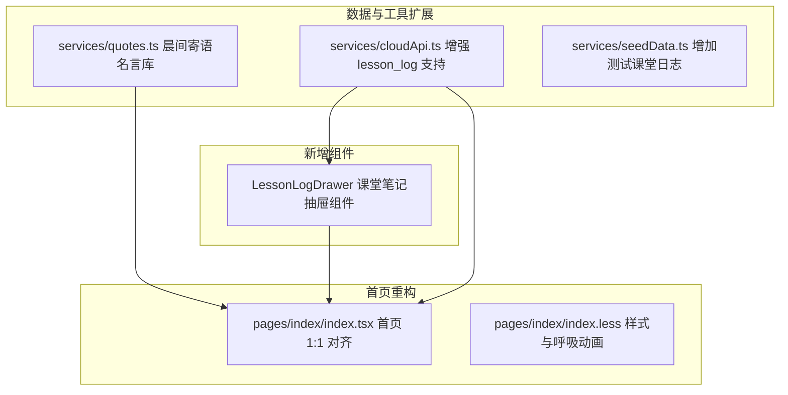

# 小程序首页与 Web 移动端 1:1 深度对齐实施计划

## 一、 目标与背景

当前小程序虽然已完成基础骨架重塑（Taro 4 + React 18 + 云开发），但首页相较于成熟的 Web 移动端首页（[Today.tsx](file:///Users/moliang/Desktop/coder/teacher/frontend/src/pages/Today.tsx)），缺失了多项教师日常高频依赖的灵魂级功能：
- 缺失 **主视觉正在上课倒计时与平滑进度条**；
- 缺失 **下课后智能锁定上一节课的「补记第 X 节」闭环**；
- 缺失 **随堂「记课堂 / 教学日志」底部滑出抽屉 (`LessonLogDrawer`)**；
- 缺失 **今日课堂笔记清单卡片**；
- 缺失 **✨ 晨间寄语（每日一句/换一句/复制）卡片**；
- 缺失 **首页任教班级切换分段控制器**；
- 缺失 **今日节奏多维统计看板**；
- 缺失 **紧要待办逾期高亮与首页一键单手办结**。

本计划旨在将上述 8 大缺失模块完整 1:1 迁移对齐到小程序端，同时严格保持微信端规范与 `test/prod` 数据隔离。

---

## 二、 User Review Required & 关键设计规范

> [!IMPORTANT]
> **全面禁用 Emoji，强制采用专业矢量 Icon 库系统**：
> - 遵从微信官方高保真 UI 与产品规范，**严禁在界面中滥用 Emoji 充当功能图标**（如 ⚡、📋、📅、✅、👨‍🏫 等）；
> - **落地方案**：封装轻量高性能的专业矢量图标组件 `<SvgIcon name="..." size={...} color={...} />`，内置现代线性/微填充矢量图标路径（包括：`book` 书本、`clock` 时钟、`bolt` 闪电、`calendar` 日历、`check-circle` 勾选、`user-group` 名册、`edit` 编辑笔、`bell` 铃铛、`quote` 寄语、`sync` 刷新、`delete` 垃圾桶等），0 网络请求、支持动态换色、高分辨率视网膜屏锐利呈现。

> [!IMPORTANT]
> **「课堂笔记」数据存储策略**：
> 课堂记录将使用云数据库 `lesson_log` 集合，字段结构与原后端完全同构：`{ 日期, 班级, 节次, 科目, 内容, _env }`。
> - 在测试环境下自动打标 `_env: 'test'`，确保测试记录不会混入正式环境；
> - 记录保存后，首页卡片状态与下方的已记笔记清单将即刻响应联动。

> [!NOTE]
> **晨间寄语数据策略**：
> 寄语模块内置一套高质量的经典名师/教育励志语录库（包含 20+ 条金句），点击【换一句】时在本地随机轮播，并优先支持云端异步更新，离线时同样秒级响应。

---

## 三、 拟变更文件与组件清单

### 1. [NEW] 专业矢量图标组件 ([weapp/src/components/SvgIcon/index.tsx](file:///Users/moliang/Desktop/coder/teacher/weapp/src/components/SvgIcon/index.tsx))
- 彻底告别 Emoji，采用标准专业 SVG 矢量图形体系；
- 包含 `book`（书本/课堂）、`bolt`（快记闪电）、`calendar`（课表）、`todo`（待办）、`users`（花名册）、`clock`（时钟）、`edit`（编辑）、`sync`（刷新/换一句）、`quote`（寄语/名言）、`bell`（铃铛提醒）、`check`（对勾）、`crown`（组长皇冠）、`trash`（删除）等；
- 支持自定义 `size`（rpx/px）与 `color` 动态调色。

### 2. [NEW] 晨间寄语精选文库与工具 ([weapp/src/services/quotes.ts](file:///Users/moliang/Desktop/coder/teacher/weapp/src/services/quotes.ts))
- 封装精美教育金句库；
- 提供 `getRandomQuote(excludeIndex)` 换一句方法；
- 提供一键复制与提示工具。

### 2. [NEW] 随堂「记课堂」底部抽屉组件 ([weapp/src/components/LessonLogDrawer](file:///Users/moliang/Desktop/coder/teacher/weapp/src/components/LessonLogDrawer))
- **`index.tsx` & `index.less`**：
  - 底部半屏向上平滑滑出的抽屉遮罩；
  - 顶部显示当前授课上下文（如：*2026-09-14 · 八3班 · 第2节 地理*）；
  - **7 大高频快捷标签**：*新课讲授、重点复习、随堂测验、作业布置、纪律良好、进度正常、重难点答疑*，轻触标签自动插入到内容中；
  - 多行文本输入区（记录知识点进度与作业）；
  - 确定保存与删除按钮，联动 `Taro.vibrateShort` 触感反馈。

### 3. [MODIFY] 增强测试种子数据 ([weapp/src/services/seedData.ts](file:///Users/moliang/Desktop/coder/teacher/weapp/src/services/seedData.ts))
- 在 `TEST_SEED_DATA` 中增加 2~3 条八3班与八4班的测试课堂日志，方便开发测试环境开箱即可验证清单效果。

### 4. [MODIFY] 小程序工作台首页全面重塑 ([weapp/src/pages/index/index.tsx](file:///Users/moliang/Desktop/coder/teacher/weapp/src/pages/index/index.tsx) & [index.less](file:///Users/moliang/Desktop/coder/teacher/weapp/src/pages/index/index.less))
- **顶部时段问候**：根据当前小时展示「早上好 / 中午好 / 下午好 / 晚上好」+ 称呼 + 公历与星期；
- **✨ 晨间寄语卡片**：紫色渐变徽标、励志金句、带旋转动效的【换一句】与【复制】；
- **班级分段选择器**：支持一键切换八3班/八4班，页面内课堂笔记与课表实时响应；
- **主视觉课程卡片群**：
  - **课内状态**：正在上课（大标题）、剩余时间倒计时（如还剩 18 分钟）、百分比动态平滑进度条、呼吸灯、底部【记课堂】+【记一笔】双按钮；
  - **课间/下课后状态**：自动定位上一节离当前最近的课程，若未记显示【补记第 X 节】，若已记显示绿色徽标【已记第 X 节 ✓】；同时提示下一节课安排；
- **今日课堂笔记清单卡片**：展示今天所有已记的课堂笔记条数，按节次排列卡片，点击任意卡片即可呼出抽屉查看或二次修改；
- **今日节奏三合一看板**：左侧今日课时大圆环（如 `3` 节课），右侧展示【待办数】、【逾期数】（红标警示）、【已记笔记数】；
- **紧要待办直接办结**：红色逾期待办置顶，**点击卡片整行直接打勾办结**并带有微触感振动反馈；
- **保留移动端 4 宫格金刚区**：单手拇指秒级直达快记、名册、课表、待办。

---

## 四、 实施阶段划分

- **Phase 1**：创建晨间寄语名言文库 `quotes.ts`，并在种子数据中补充 `lesson_log` 示例数据；
- **Phase 2**：开发 `LessonLogDrawer` 底部抽屉组件（样式、快捷标签、多行输入、云端保存）；
- **Phase 3**：全面升级重塑首页 `pages/index/index.tsx` 与样式 `index.less`；
- **Phase 4**：执行 `pnpm run build:weapp` 与 `pnpm run build:test`，验证 0 错误编译通过与完整操作流闭环。

---

## 五、 验证方案

1. **编译打包验证**：
   - 运行 `cd weapp && pnpm run build:weapp`，确保 TypeScript 类型校验与打包零报错。
2. **交互功能验证**：
   - 验证【换一句】与【复制】晨间寄语是否流畅；
   - 验证上课中【记课堂】和下课后【补记第 X 节】能否精准拉起抽屉；
   - 验证点选快捷标签能否自动填入，点击保存后卡片是否即刻变为“已记第 X 节 ✓”并在下方笔记清单实时刷新；
   - 验证首页紧要待办点击整行能否直接标记办结并触发振动；
   - 验证切换班级时数据是否精准联动。
